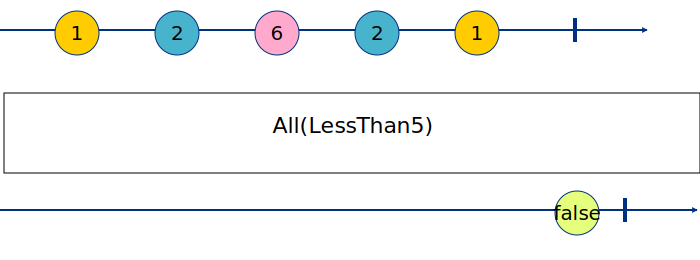

# Operators

## All
[](https://pkg.go.dev/github.com/reactivego/rx?tab=doc#Observable.All)
[](https://godoc.org/github.com/reactivego/rx#Observable.All)
[](http://reactivex.io/documentation/operators/all.html)

**All** determines whether all items emitted by an Observable meet some
criteria.

Pass a predicate function to the **All** operator that accepts an item emitted
by the source Observable and returns a boolean value based on an
evaluation of that item. **All** returns an ObservableBool that emits a single
boolean value: true if and only if the source Observable terminates
normally and every item emitted by the source Observable evaluated as
true according to the predicate; false if any item emitted by the source
Observable evaluates as false according to the predicate.



Code:
```go
// Setup All to produce true only when all source values are less than 5
lessthan5 := func(i interface{}) bool {
	return i.(int) < 5
}

result, err := rx.From(1, 2, 5, 2, 1).All(lessthan5).ToSingle()

fmt.Println("All values less than 5?", result, err)

result, err = rx.From(4, 1, 0, -1, 2, 3, 4).All(lessthan5).ToSingle()

fmt.Println("All values less than 5?", result, err)
```
Output:
```
All values less than 5? false <nil>
All values less than 5? true <nil>
```
## AsObservable
[](https://pkg.go.dev/github.com/reactivego/rx?tab=doc#Observable.AsObservable)
[](https://godoc.org/github.com/reactivego/rx#Observable.AsObservable)

**AsObservable&lt;Bar&gt;** when called on an `Observable` source will type assert the `interface{}` items of the source to &lt;bar&gt; items. E.g. `AsObservableInt`, `AsObservableBool`.

If the assertion is invalid, this will emit a type assertion error
`ErrTypecastTo<Bar>` at run-time. When `AsObservable<Bar>` is called on an
`Observable<Foo>`, then a type conversion is generated. This has to be possible,
because if it is not, your generated code will simply not compile. A special
case of this is when using AsObservable, as this will convert to interface{},
so that will always compile and work.


## AuditTime
[](https://pkg.go.dev/github.com/reactivego/rx?tab=doc#Observable.AuditTime)
[](https://godoc.org/github.com/reactivego/rx#Observable.AuditTime)
[](https://rxjs.dev/api/operators/auditTime)

**AuditTime** waits until the source emits and then starts a timer. When the timer
expires, **AuditTime** will emit the last value received from the source during the
time period when the timer was active.

## AutoConnect
See [AutoConnect](test/AutoConnect) in test folder.
## Average
See [Average](test/Average) in test folder.
## Catch :star:
See [Catch](test/Catch) in test folder.
## CatchError :star:
See [CatchError](test/CatchError) in test folder.
## CombineLatest :star:
See [CombineLatest](test/CombineLatest) in test folder.
## CombineLatestAll
See [CombineLatestAll](test/CombineLatestAll) in test folder.
## CombineLatestMap
See [CombineLatestMap](test/CombineLatestMap) in test folder.
## CombineLatestMapTo
See [CombineLatestMapTo](test/CombineLatestMapTo) in test folder.
## CombineLatestWith
See [CombineLatestWith](test/CombineLatestWith) in test folder.
## Concat :star:
See [Concat](test/Concat) in test folder.
## ConcatAll
See [ConcatAll](test/ConcatAll) in test folder.
## ConcatMap :star:
See [ConcatMap](test/ConcatMap) in test folder.
## ConcatMapTo
See [ConcatMapTo](test/ConcatMapTo) in test folder.
## ConcatWith :star:
See [ConcatWith](test/ConcatWith) in test folder.
## Connect
See [Connect](test/Connect) in test folder.
## Count
See [Count](test/Count) in test folder.
## Create :star:
See [Create](test/Create) in test folder.
## CreateFutureRecursive
See [CreateFutureRecursive](test/CreateFutureRecursive) in test folder.
## CreateRecursive
See [CreateRecursive](test/CreateRecursive) in test folder.
## DebounceTime :star:
See [DebounceTime](test/DebounceTime) in test folder.
## Defer
See [Defer](test/Defer) in test folder.
## Delay
See [Delay](test/Delay) in test folder.
## Distinct
See [Distinct](test/Distinct) in test folder.
## Do :star:
See [Do](test/Do) in test folder.
## DoOnComplete
See [DoOnComplete](test/DoOnComplete) in test folder.
## DoOnError
See [DoOnError](test/DoOnError) in test folder.
## ElementAt
See [ElementAt](test/ElementAt) in test folder.
## Empty
See [Empty](test/Empty) in test folder.
## Filter :star:
See [Filter](test/Filter) in test folder.
## Finally
See [Finally](test/Finally) in test folder.
## First
See [First](test/First) in test folder.
## From :star:
See [From](test/From) in test folder.
## FromChan
See [FromChan](test/FromChan) in test folder.
## IgnoreCompletion
See [IgnoreCompletion](test/IgnoreCompletion) in test folder.
## IgnoreElements
See [IgnoreElements](test/IgnoreElements) in test folder.
## Interval
See [Interval](test/Interval) in test folder.
## Just :star:
See [Just](test/Just) in test folder.
## Last
See [Last](test/Last) in test folder.
## Map :star:
See [Map](test/Map) in test folder.
## Max
See [Max](test/Max) in test folder.
## Merge :star:
See [Merge](test/Merge) in test folder.
## MergeAll
See [MergeAll](test/MergeAll) in test folder.
## MergeDelayError
See [MergeDelayError](test/MergeDelayError) in test folder.
## MergeDelayErrorWith
See [MergeDelayErrorWith](test/MergeDelayErrorWith) in test folder.
## MergeMap :star:
See [MergeMap](test/MergeMap) in test folder.
## MergeWith :star:
See [MergeWith](test/MergeWith) in test folder.
## Min
See [Min](test/Min) in test folder.
## Never
See [Never](test/Never) in test folder.
## ObserveOn
See [ObserveOn](test/ObserveOn) in test folder.
## Of :star:
See [Of](test/Of) in test folder.
## Only
See [Only](test/Only) in test folder.
## Passthrough
See [Passthrough](test/Passthrough) in test folder.
## Println
See [Println](test/Println) in test folder.
## Publish :star:
See [Publish](test/Publish) in test folder.
## PublishReplay :star:
See [PublishReplay](test/PublishReplay) in test folder.
## Range
See [Range](test/Range) in test folder.
## Reduce
See [Reduce](test/Reduce) in test folder.
## RefCount
See [RefCount](test/RefCount) in test folder.
## Repeat
See [Repeat](test/Repeat) in test folder.
## ReplaySubject
See [ReplaySubject](test/ReplaySubject) in test folder.
## Retry
See [Retry](test/Retry) in test folder.
## SampleTime
See [SampleTime](test/SampleTime) in test folder.
## Scan :star:
See [Scan](test/Scan) in test folder.
## Serialize
See [Serialize](test/Serialize) in test folder.
## Single
See [Single](test/Single) in test folder.
## Skip
See [Skip](test/Skip) in test folder.
## SkipLast
See [SkipLast](test/SkipLast) in test folder.
## Start
See [Start](test/Start) in test folder.
## Subject
See [Subject](test/Subject) in test folder.
## Subscribe
See [Subscribe](test/Subscribe) in test folder.
## SubscribeOn
[](https://pkg.go.dev/github.com/reactivego/rx?tab=doc#Observable.SubscribeOn)
[](https://godoc.org/github.com/reactivego/rx#Observable.SubscribeOn)
[](http://reactivex.io/documentation/operators/subscribeon.html)

**SubscribeOn** specifies which [scheduler](https://github.com/reactivego/scheduler) an Observable should use when it is subscribed to.

### Example (SubscribeOn Trampoline)
Code:
```go
trampoline := rx.MakeTrampolineScheduler()
observer := func(next interface{}, err error, done bool) {
	switch {
	case !done:
		fmt.Println(trampoline, "print", next)
	case err != nil:
		fmt.Println(trampoline, "print", err)
	default:
		fmt.Println(trampoline, "print", "complete")
	}
}
fmt.Println(trampoline, "SUBSCRIBING...")
subscription := rx.From(1, 2, 3).SubscribeOn(trampoline).Subscribe(observer)
fmt.Println(trampoline, "WAITING...")
subscription.Wait()
fmt.Println(trampoline, "DONE")
```
Output:
```
Trampoline{ tasks = 0 } SUBSCRIBING...
Trampoline{ tasks = 1 } WAITING...
Trampoline{ tasks = 1 } print 1
Trampoline{ tasks = 1 } print 2
Trampoline{ tasks = 1 } print 3
Trampoline{ tasks = 1 } print complete
Trampoline{ tasks = 0 } DONE
```

### Example (SubscribeOn Goroutine)
Code:
```go
const ms = time.Millisecond
goroutine := rx.GoroutineScheduler()
observer := func(next interface{}, err error, done bool) {
	switch {
	case !done:
		fmt.Println(goroutine, "print", next)
	case err != nil:
		fmt.Println(goroutine, "print", err)
	default:
		fmt.Println(goroutine, "print", "complete")
	}
}
fmt.Println(goroutine, "SUBSCRIBING...")
subscription := rx.From(1, 2, 3).Delay(10 * ms).SubscribeOn(goroutine).Subscribe(observer)
// Mpte that without a Delay the next Println lands at a random spot in the output.
fmt.Println("WAITING...")
subscription.Wait()
fmt.Println(goroutine, "DONE")
```
Output:
```
Output:
Goroutine{ goroutines = 0 } SUBSCRIBING...
WAITING...
Goroutine{ goroutines = 1 } print 1
Goroutine{ goroutines = 1 } print 2
Goroutine{ goroutines = 1 } print 3
Goroutine{ goroutines = 1 } print complete
Goroutine{ goroutines = 0 } DONE
```

## Sum
See [Sum](test/Sum) in test folder.
## SwitchAll
See [SwitchAll](test/SwitchAll) in test folder.
## SwitchMap :star:
See [SwitchMap](test/SwitchMap) in test folder.
## Take :star:
See [Take](test/Take) in test folder.
## TakeLast
See [TakeLast](test/TakeLast) in test folder.
## TakeUntil :star:
See [TakeUntil](test/TakeUntil) in test folder.
## TakeWhile
See [TakeWhile](test/TakeWhile) in test folder.
## ThrottleTime
See [ThrottleTime](test/ThrottleTime) in test folder.
## Throw
See [Throw](test/Throw) in test folder.
## Ticker
See [Ticker](test/Ticker) in test folder.
## TimeInterval
See [TimeInterval](test/TimeInterval) in test folder.
## Timeout
See [Timeout](test/Timeout) in test folder.
## Timer
See [Timer](test/Timer) in test folder.
## Timestamp
See [Timestamp](test/Timestamp) in test folder.
## ToChan
See [ToChan](test/ToChan) in test folder.
## ToSingle
See [ToSingle](test/ToSingle) in test folder.
## ToSlice
See [ToSlice](test/ToSlice) in test folder.
## Wait
See [Wait](test/Wait) in test folder.

 :star: - commonly used
