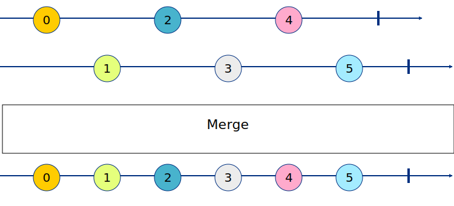

# rx

    import "github.com/reactivego/rx"

[](https://pkg.go.dev/github.com/reactivego/rx?tab=doc)
[](https://godoc.org/github.com/reactivego/rx)
[](http://reactivex.io/intro.html)

Package `rx` provides *Reactive Extensions* for Go, an API for asynchronous programming with observable streams.

> Our intellectual powers are rather geared to master static relations and our powers to visualize processes evolving in time are relatively poorly developed.
> For that reason we should do our utmost to shorten the conceptual gap between the static program and the dynamic process, to make the correspondence between the program (spread out in text space) and the process (spread out in time) as trivial as possible.
>
> *Edsger W. Dijkstra*, March 1968

### Installation
Use the go tool to get the package:

```bash
$ go get github.com/reactivego/rx
```

Then import it in your program:

```go
import "github.com/reactivego/rx"
```
## Usage
The API is accessed directly through the `rx` prefix.
```go
rx.From(1,2,"hello").Println()
```
For documentation and examples, see the online [go.dev](https://pkg.go.dev/github.com/reactivego/rx?tab=doc) or [godoc](http://godoc.org/github.com/reactivego/rx) reference.

> NOTE : this package can also be used as a *Generics Library* for *Go 1* see [below](#generics-library)

## Observables
The main focus of `rx` is on [Observables](http://reactivex.io/documentation/observable.html).
In accordance with Dijkstra's observation that we are relatively bad at grasping dynamic processes evolving in time, Observables indeed shorten the conceptual gap between the static program and the dynamic process. Observables have dynamic behavior folded into their core as they are defined as values changing over time. Observables are combined using (lots of different) operators that compose well together. At the program level you are no longer dealing explicitly with dynamic processes, that is all defined and implied by the operators that were used to construct the program.

An Observable:

- is a stream of events.
- assumes zero to many values over time.
- pushes values
- can take any amount of time to complete (or may never)
- is cancellable
- is lazy (it doesn't do anything until you subscribe).

This package uses `interface{}` for entry types, so an observable can emit a
mix of differently typed entries. To create an observable that emits three
values of different types you could write the following little program.

```go
package main

import "github.com/reactivego/rx"

func main() {
    rx.From(1,"hi",2.3).Println()
}
```
> Note the program creates a mixed type observable from an int, string and a float.

Observables in `rx` are somewhat similar to Go channels but have much richer
semantics:

Observables can be hot or cold. A hot observable will try to emit values even
when nobody is subscribed. As long as there are no subscribers the values of
a hot observable are lost. The position of a mouse pointer or the current time
are examples of hot observables. 

A cold observable will only start emitting values when somebody subscribes.
The contents of a file or a database are examples of cold observables.

An observable can complete normally or with an error, it uses subscriptions
that can be canceled from the subscriber side. Where a normal variable is
just a place where you read and write values from, an observable captures how
the value of this variable changes over time.

Concurrency flows naturally from the fact that an observable is an ever
changing stream of values. Every Observable conceptually has at its core a
concurrently running process that pushes out values.

## Operators 
Operators form a language in which programs featuring Observables can be expressed.
They work on one or more Observables to transform, filter and combine them into new Observables.

Following are the most commonly used operators:

<details><summary>BufferTime</summary>

#### TBD

</details>
<details><summary>Catch</summary>

#### TBD

</details>
<details><summary>CatchError</summary>

#### TBD

</details>
<details><summary>CombineLatest</summary>

#### TBD

</details>
<details><summary>Concat</summary>

#### TBD

</details>
<details><summary>ConcatMap</summary>

#### TBD

</details>
<details><summary>ConcatWith</summary>

#### TBD

</details>
<details><summary>Create</summary>

#### TBD

</details>
<details><summary>DebounceTime</summary>

#### TBD

</details>
<details><summary>DistinctUntilChanged</summary>

#### TBD

</details>
<details><summary>Do</summary>

#### TBD

</details>
<details><summary>Filter</summary>

#### TBD

</details>
<details><summary>From</summary>

#### TBD

</details>
<details><summary>Just</summary>

#### TBD

</details>
<details><summary>Map</summary>

#### TBD

</details>
<details><summary>Merge</summary>

combines multiple Observables into one by merging their emissions.
An error from any of the observables will terminate the merged observables.



Code:
```go
a := rx.From(0, 2, 4)
b := rx.From(1, 3, 5)
rx.Merge(a, b).Println()
```
Output:
```
0
1
2
3
4
5
```

</details>
<details><summary>MergeMap</summary>

#### TBD

</details>
<details><summary>MergeWith</summary>

combines multiple Observables into one by merging their emissions.
An error from any of the observables will terminate the merged observables.


Code:
```go
a := rx.From(0, 2, 4)
b := rx.From(1, 3, 5)
a.MergeWith(b).Println()
```
Output:
```
0
1
2
3
4
5
```

</details>
<details><summary>Of</summary>

#### TBD

</details>
<details><summary>Publish</summary>

#### TBD

</details>
<details><summary>PublishReplay</summary>

#### TBD

</details>
<details><summary>Scan</summary>

#### TBD

</details>
<details><summary>StartWith</summary>

#### TBD

</details>
<details><summary>SwitchMap</summary>

#### TBD

</details>
<details><summary>Take</summary>

#### TBD

</details>
<details><summary>TakeUntil</summary>

#### TBD

</details>
<details><summary>WithLatestFrom</summary>

#### TBD

</details>

## Concurency

The `rx` package does not use any 'bare' go routines internally. Concurrency is tightly controlled by the use of a specific [scheduler](https://github.com/reactivego/scheduler).
Currently there is a choice between 2 different schedulers; a *trampoline* schedulers and a *goroutine* scheduler.

By default all subscribing operators except `ToChan` use the *trampoline* scheduler. A *trampoline* puts tasks on a task queue and only starts processing them when the `Wait` method is called on a returned subscription. The subscription itself calls the `Wait` method of the scheduler.

Only the `Connect` and `Subscribe` methods return a subscription. The other subscribing operators `Println`, `ToSingle`, `ToSlice` and `Wait` are blocking by default and only return when the scheduler returns after wait. In the case of `ToSingle` and `ToSlice` both a value and error are returned and in the case of `Println` and `Wait` just an error is returned or nil when the observable completed succesfully.

The only operator that uses the *goroutine* scheduler by default is the `ToChan` operator. `ToChan` returns a channel that it feeds by subscribing on the *goroutine* scheduler.

To change the scheduler on which subscribing needs to occur, use the [SubscribeOn](OPERARTORS.md#subscribeon) operator

## Regenerating this Package
This package is generated from generics in the sub-folder generic by the [jig](http://github.com/reactivego/jig) tool.
You don't need to regenerate this package in order to use it. However, if you are
interested in regenerating it, then read on.

The [jig](http://github.com/reactivego/jig) tool provides the parametric polymorphism capability that Go 1 is missing.
It works by replacing place-holder types of generic functions and datatypes
with `interface{}` (it can also generate statically typed code though).

To regenerate, change the current working directory to the package directory
and run the [jig](http://github.com/reactivego/jig) tool as follows:

```bash
$ go get -d github.com/reactivego/jig
$ go run github.com/reactivego/jig -v
```
## Generics Library
This package can be used as a *Generics Library* for *Go 1*. It supports the writing of programs that use statically typed *Observables* and *Operators*. For example:

```go
package main

import _ "github.com/reactivego/rx"

func main() {
	FromString("Hello", "Gophers!").Println()
}
```
> Note that From**String** is statically typed.

Instructions on how to use the package this way, are located in the [generic](generic) folder.

## Acknowledgements
This library started life as the [Reactive eXtensions for Go](https://github.com/alecthomas/gorx) library by *Alec Thomas*. Although the library has been through the metaphorical meat grinder a few times, its DNA is still clearly present in this library and I owe Alec a debt of grattitude for the work he has made so generously available.

This implementation takes most of its cues from [RxJS](https://github.com/ReactiveX/rxjs).
It is the ReactiveX incarnation that pushes the envelope in evolving operator semantics.

## License
This library is licensed under the terms of the MIT License. See [LICENSE](LICENSE) file for copyright notice and exact wording.
