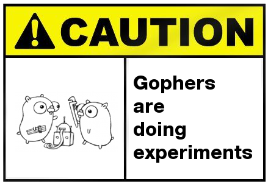

# rx

    import _ "github.com/reactivego/rx"

[](http://godoc.org/github.com/reactivego/rx)

Library `rx` provides [Reactive eXtensions](http://reactivex.io/) for [Go](https://golang.org/). It's a generics library for composing asynchronous and event-based programs using observable sequences. The library consists of more than a 100 templates to enable type-safe programming with observable streams. To use it, you will need the *jig* tool from [Just-in-time Generics for Go](https://github.com/reactivego/jig).

Using the library is very simple. Import the library with the blank identifier `_` as the package name. The side effect of this import is that generics from the library can now be accessed by the *jig* tool. Then start using generics from the library and run *jig* to generate code. The following is a minimal *Hello, World!* program:

```go
package main

import _ "github.com/reactivego/rx"

func main() {
	FromStrings("You!", "Gophers!", "World!").
		MapString(func(x string) string {
			return "Hello, " + x
		}).
		SubscribeNext(func(next string) {
			println(next)
		})

	// Output:
	// Hello, You!
	// Hello, Gophers!
	// Hello, World!
}
```

Take a look at the [Quick Start](doc/QUICKSTART.md) guide to see how it all fits together.

## Table of Contents

<!-- MarkdownTOC -->

- [Why?](#why)
- [Generic Programming](#generic-programming)
- [Operators](#operators)
	- [Creating Operators](#creating-operators)
	- [Transforming Operators](#transforming-operators)
	- [Filtering Operators](#filtering-operators)
	- [Combining Operators](#combining-operators)
	- [Multicasting Operators](#multicasting-operators)
	- [Error Handling Operators](#error-handling-operators)
	- [Utility Operators](#utility-operators)
	- [Conditional and Boolean Operators](#conditional-and-boolean-operators)
	- [Mathematical and Aggregate Operators](#mathematical-and-aggregate-operators)
	- [Scheduling Operators](#scheduling-operators)
	- [Type Casting, Converting and Filtering Operators](#type-casting-converting-and-filtering-operators)
- [Subjects](#subjects)
- [Subscribing](#pragma-reference)
- [Obligatory Dijkstra Quote](#obligatory-dijkstra-quote)
- [Acknowledgements](#acknowledgements)
- [License](#license)

<!-- /MarkdownTOC -->

## Why?
ReactiveX observables are somewhat similar to Go channels but have much richer semantics. Observables can be hot or cold, can complete normally or with an error, use subscriptions that can be cancelled from the subscriber side. Where a normal variable is just a place where you read and write values from, an observable captures how the value of this variable changes over time. Concurrency follows naturally from the fact that an observable is an ever changing stream of values.

`rx` is a library of operators that work on one or more observables. The way in which observables can be combined using operators to form new observables is the real strength of ReactiveX. Operators specify how observables representing streams of values are e.g. merged, transformed, concatenated, split, multicasted, replayed, delayed and debounced. My observation is that [RxJS 5](https://github.com/ReactiveX/rxjs) and [RxJava 2](https://github.com/ReactiveX/RxJava) have been pushing the envelope in evolving ReactiveX operator semantics. The whole field is still in flux, but the more Rx is applied, the more patterns are emerging. I would like Go to be a participant in this field as well, but for that to happen we need....

## Generic Programming

`rx` is a generics library of templates compatible with [Just-in-time Generics for Go](https://github.com/reactivego/jig). In generic programming you need to specify place-holder types like e.g. the `T` in `Map<T>`. Because we want our generic code to build normally, we work with so called metasyntactic type names like *Foo* and *Bar* so e.g. `MapFoo` instead of `Map<T>`. To actually use the generics just replace *Foo* with the actual type you need e.g. for `int` use `MapInt` and for `string` use `MapString`.

## Operators 

**This implementation of ReactiveX is highly experimental!**


Folowing is a list of [ReactiveX operators](http://reactivex.io/documentation/operators.html) that have been implemented. Operators that are most commonly used got a :star:.

### Creating Operators
Operators that originate new Observables.

- [**CreateFoo**](https://godoc.org/github.com/ReactiveGo/rx/test/Create/)() :star: ObservableFoo
- [**DeferFoo**](https://godoc.org/github.com/ReactiveGo/rx/test/Defer/)() ObservableFoo
- [**EmptyFoo**](https://godoc.org/github.com/ReactiveGo/rx/test/Empty/)() ObservableFoo
- [**FromChanFoo**](https://godoc.org/github.com/ReactiveGo/rx/test/From/)() ObservableFoo
- [**FromSliceFoo**](https://godoc.org/github.com/ReactiveGo/rx/test/From/)() ObservableFoo
- [**FromFoos**](https://godoc.org/github.com/ReactiveGo/rx/test/From/)() ObservableFoo
- [**FromFoo**](https://godoc.org/github.com/ReactiveGo/rx/test/From/)() :star: ObservableFoo
- [**Interval**](https://godoc.org/github.com/ReactiveGo/rx/test/Interval/)() ObservableInt
- [**JustFoo**](https://godoc.org/github.com/ReactiveGo/rx/test/Just/)() :star: ObservableFoo
- [**NeverFoo**](https://godoc.org/github.com/ReactiveGo/rx/test/Never/)() ObservableFoo
- [**Range**](https://godoc.org/github.com/ReactiveGo/rx/test/Range/)() ObservableInt
- [**RepeatFoo**](https://godoc.org/github.com/ReactiveGo/rx/test/Repeat/)() ObservableFoo
- (ObservableFoo) [**Repeat**](https://godoc.org/github.com/ReactiveGo/rx/test/Repeat/)() ObservableFoo
- [**StartFoo**](https://godoc.org/github.com/ReactiveGo/rx/test/Start/)() ObservableFoo
- [**ThrowFoo**](https://godoc.org/github.com/ReactiveGo/rx/test/Throw/)() ObservableFoo

### Transforming Operators
Operators that transform items that are emitted by an Observable.

- BufferTime :star:
- ConcatMap :star:
- (ObservableFoo) [**MapBar**](https://godoc.org/github.com/ReactiveGo/rx/test/Map/)() :star: ObservableBar
- (ObservableFoo) [**MergeMapBar**](https://godoc.org/github.com/ReactiveGo/rx/test/MergeMap/)() :star: ObservableBar
- (ObservableFoo) [**ScanBar**](https://godoc.org/github.com/ReactiveGo/rx/test/Scan/)() :star: ObservableBar
- SwitchMap :star:

### Filtering Operators
Operators that selectively emit items from a source Observable.

- (ObservableFoo) [**Debounce**](https://godoc.org/github.com/ReactiveGo/rx/test/Debounce/)() ObservableFoo
- DebounceTime :star:
- (ObservableFoo) [**Distinct**](https://godoc.org/github.com/ReactiveGo/rx/test/Distinct/)() ObservableFoo
- DistinctUntilChanged :star:
- (ObservableFoo) [**ElementAt**](https://godoc.org/github.com/ReactiveGo/rx/test/ElementAt/)() ObservableFoo
- (ObservableFoo) [**Filter**](https://godoc.org/github.com/ReactiveGo/rx/test/Filter/)() :star: ObservableFoo
- (ObservableFoo) [**First**](https://godoc.org/github.com/ReactiveGo/rx/test/First/)() ObservableFoo
- (ObservableFoo) [**IgnoreElements**](https://godoc.org/github.com/ReactiveGo/rx/test/IgnoreElements/)() ObservableFoo
- (ObservableFoo) [**IgnoreCompletion**](https://godoc.org/github.com/ReactiveGo/rx/test/IgnoreCompletion/)() ObservableFoo
- (ObservableFoo) [**Last**](https://godoc.org/github.com/ReactiveGo/rx/test/Last/)() ObservableFoo
- (ObservableFoo) [**Sample**](https://godoc.org/github.com/ReactiveGo/rx/test/Sample/)() ObservableFoo
- (ObservableFoo) [**Single**](https://godoc.org/github.com/ReactiveGo/rx/test/Single/)() ObservableFoo
- (ObservableFoo) [**Skip**](https://godoc.org/github.com/ReactiveGo/rx/test/Skip/)() ObservableFoo
- (ObservableFoo) [**SkipLast**](https://godoc.org/github.com/ReactiveGo/rx/test/SkipLast/)() ObservableFoo
- (ObservableFoo) [**Take**](https://godoc.org/github.com/ReactiveGo/rx/test/Take/)() :star: ObservableFoo
- TakeUntil :star:
- (ObservableFoo) [**TakeLast**](https://godoc.org/github.com/ReactiveGo/rx/test/TakeLast/)() ObservableFoo

### Combining Operators
Operators that work with multiple source Observables to create a single Observable.

- CombineLatest :star:
- [**ConcatFoo**](https://godoc.org/github.com/ReactiveGo/rx/test/Concat/)() :star: ObservableFoo
- (ObservableFoo) [**Concat**](https://godoc.org/github.com/ReactiveGo/rx/test/Concat/)() :star: ObservableFoo
- (Observable<sup>2</sup>Foo) [**ConcatAll**](https://godoc.org/github.com/ReactiveGo/rx/test/ConcatAll/)() ObservableFoo
- [**MergeFoo**](https://godoc.org/github.com/ReactiveGo/rx/test/Merge/)() ObservableFoo
- (ObservableFoo) [**Merge**](https://godoc.org/github.com/ReactiveGo/rx/test/Merge/)() :star: ObservableFoo
- (Observable<sup>2</sup>Foo) [**MergeAll**](https://godoc.org/github.com/ReactiveGo/rx/test/MergeAll/)() ObservableFoo
- [**MergeDelayErrorFoo**](https://godoc.org/github.com/ReactiveGo/rx/test/MergeDelayError/)() ObservableFoo
- (ObservableFoo) [**MergeDelayError**](https://godoc.org/github.com/ReactiveGo/rx/test/MergeDelayError/)() ObservableFoo
- StartWith :star:
- WithLatestFrom :star:

### Multicasting Operators
Operators that provide subscription multicasting from 1 to multiple subscribers.

- (ObservableFoo) [**Publish**](https://godoc.org/github.com/ReactiveGo/rx/test/Publish/)() ConnectableFoo
- (ObservableFoo) [**PublishReplay**](https://godoc.org/github.com/ReactiveGo/rx/test/PublishReplay/)() ConnectableFoo
- PublishLast
- PublishBehavior
- (ConnectableFoo) [**RefCount**](https://godoc.org/github.com/ReactiveGo/rx/test/RefCount/)() ObservableFoo
- (ConnectableFoo) [**AutoConnect**](https://godoc.org/github.com/ReactiveGo/rx/test/AutoConnect/)() ObservableFoo

### Error Handling Operators
Operators that help to recover from error notifications from an Observable.

- (ObservableFoo) [**Catch**](https://godoc.org/github.com/ReactiveGo/rx/test/Catch/)() :star: ObservableFoo
- (ObservableFoo) [**Retry**](https://godoc.org/github.com/ReactiveGo/rx/test/Retry/)() ObservableFoo

### Utility Operators
A toolbox of useful Operators for working with Observables.

- (ObservableFoo) [**Do**](https://godoc.org/github.com/ReactiveGo/rx/test/Do/)() :star: ObservableFoo
- (ObservableFoo) [**DoOnError**](https://godoc.org/github.com/ReactiveGo/rx/test/Do/)() ObservableFoo
- (ObservableFoo) [**DoOnComplete**](https://godoc.org/github.com/ReactiveGo/rx/test/Do/)() ObservableFoo
- (ObservableFoo) [**Finally**](https://godoc.org/github.com/ReactiveGo/rx/test/Do/)() ObservableFoo
- (ObservableFoo) [**Passthrough**](https://godoc.org/github.com/ReactiveGo/rx/test/Passthrough/)() ObservableFoo
- (ObservableFoo) [**Serialize**](https://godoc.org/github.com/ReactiveGo/rx/test/Serialize/)() ObservableFoo
- (ObservableFoo) [**Timeout**](https://godoc.org/github.com/ReactiveGo/rx/test/Timeout/)() ObservableFoo

### Conditional and Boolean Operators
Operators that evaluate one or more Observables or items emitted by Observables.

None yet. Who needs logic anyway?

### Mathematical and Aggregate Operators
Operators that operate on the entire sequence of items emitted by an Observable.

- (ObservableFoo) [**Average**](https://godoc.org/github.com/ReactiveGo/rx/test/Average/)() ObservableFoo
- (ObservableFoo) [**Count**](https://godoc.org/github.com/ReactiveGo/rx/test/Count/)() ObservableInt
- (ObservableFoo) [**Max**](https://godoc.org/github.com/ReactiveGo/rx/test/Max/)() ObservableFoo
- (ObservableFoo) [**Min**](https://godoc.org/github.com/ReactiveGo/rx/test/Min/)() ObservableFoo
- (ObservableFoo) [**ReduceBar**](https://godoc.org/github.com/ReactiveGo/rx/test/Reduce/)() ObservableBar
- (ObservableFoo) [**Sum**](https://godoc.org/github.com/ReactiveGo/rx/test/Sum/)() ObservableFoo

### Scheduling Operators
Change the scheduler for subscribing and observing.

- (ObservableFoo) [**ObserveOn**](https://godoc.org/github.com/ReactiveGo/rx/test/ObserveOn/)() ObservableFoo
- (ObservableFoo) [**SubscribeOn**](https://godoc.org/github.com/ReactiveGo/rx/test/SubscribeOn/)() ObservableFoo

### Type Casting, Converting and Filtering Operators
Operators to type cast, type convert and type filter observables.

- (ObservableFoo) [**AsObservableBar**](https://godoc.org/github.com/ReactiveGo/rx/test/AsObservable)() ObservableBar
- (Observable) [**OnlyFoo**](https://godoc.org/github.com/ReactiveGo/rx/test/Only/)() ObservableFoo

## Subjects
A *Subject* is both a multicasting *Observable* as well as an *Observer*. The *Observable* side allows multiple simultaneous subscribers. The *Observer* side allows you to directly feed it data or subscribe it to another *Observable*.

- [**NewSubjectFoo**](https://godoc.org/github.com/ReactiveGo/rx/test/)() SubjectFoo
- [**NewReplaySubjectFoo**](https://godoc.org/github.com/ReactiveGo/rx/test/)() SubjectFoo

## Subscribing
Subscribing breathes life into a chain of observables.

- (ObservableFoo) [**Subscribe**](https://godoc.org/github.com/ReactiveGo/rx/test/)() Subscriber
	Following methods call Subscribe internally:
	- (ConnectableFoo) [**Connect**](https://godoc.org/github.com/ReactiveGo/rx/test/)() Subscriber
		Following operators call Connect internally:
		- (ConnectableFoo) [**RefCount**](https://godoc.org/github.com/ReactiveGo/rx/test/RefCount)() ObservableFoo
		- (ConnectableFoo) [**AutoConnect**](https://godoc.org/github.com/ReactiveGo/rx/test/AutoConnect)() ObservableFoo
	- (ObservableFoo) [**SubscribeNext**](https://godoc.org/github.com/ReactiveGo/rx/test/) Subsciber
	- (ObservableFoo) [**ToChan**](https://godoc.org/github.com/ReactiveGo/rx/test/)()chan foo
	- (ObservableFoo) [**ToSingle**](https://godoc.org/github.com/ReactiveGo/rx/test/)() (foo, error)
	- (ObservableFoo) [**ToSlice**](https://godoc.org/github.com/ReactiveGo/rx/test/)() ([]foo, error)
	- (ObservableFoo) [**Wait**](https://godoc.org/github.com/ReactiveGo/rx/test/)() error

## Obligatory Dijkstra Quote

Our intellectual powers are rather geared to master static relations and our powers to visualize processes evolving in time are relatively poorly developed. For that reason we should do our utmost to shorten the conceptual gap between the static program and the dynamic process, to make the correspondence between the program (spread out in text space) and the process (spread out in time) as trivial as possible.

*Edsger W. Dijkstra*, March 1968

## Acknowledgements
This library started life as the [Reactive eXtensions for Go](https://github.com/alecthomas/gorx) library by *Alec Thomas*. Although the library has been through the metaphorical meat grinder a few times, its DNA is still clearly present in this library and I owe Alec a debt of grattitude for the work he has made so generously available.

The image *Gophers are doing experiments* was borrowed from the [Go on Mobile](https://github.com/golang/mobile) project and uploaded there by Google's *Hana Kim*.

## License
This library is licensed under the terms of the MIT License. See [LICENSE](LICENSE) file in this repository for copyright notice and exact wording.
