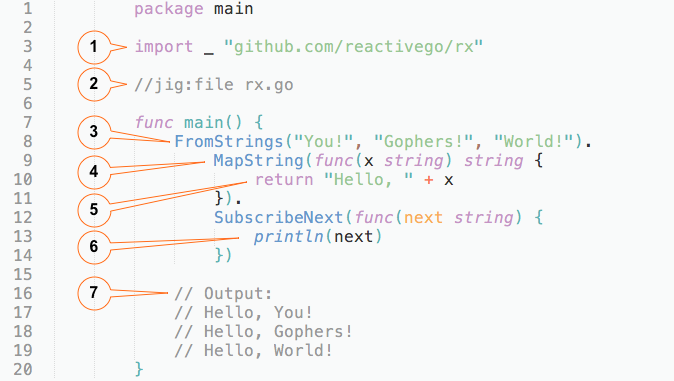

# Quick Start

This tutorial introduces both [**Just-In-time Generics for Go**](https://github.com/reactivego/jig) (**jig**) and the generics library [**Reactive eXtensions for Go**](https://github.com/reactivego/rx) (**rx**). The purpose of this tutorial is to show the workflow involved in working with *jig* and *rx*. The quickest way to do that, is by showing you how to write a simple reactive "Hello, World!" program that uses the *rx* library.

## Installation

> Assumed you have Go [installed](https://golang.org/doc/install) and did the `GOPATH` [song and dance](https://golang.org/doc/code.html#GOPATH).

To install, open a terminal and run:

```bash
go get github.com/reactivego/jig
go get github.com/reactivego/rx
```

> Note the first line will install the `jig` command in your `GOPATH` bin directory and the second one will download `rx`.

## How it works

- You develop code that references templates from the `rx` library.
- You run the *jig* command in the directory where your code is located.
- **Now *jig* analyzes your code and determines what additional code is needed to make it build**.
- *Jig* takes templates from the `rx` library and specializes them on specific types.
- Specializations are generated into a file alongside your own code.
- If all went well, your code will now build.

## Setup

Now let's create a new folder for our `helloworld` program and start editing it.

```bash
mkdir -p $GOPATH/src/helloworld
cd $GOPATH/src/helloworld
subl main.go
```
> NOTE we're running `subl` to open *Sublime Text*, but any text editor will do.

## Code
Now that you have your [`main.go`](../example/helloworld/main.go) file open in your editor of choice, type the following code:



> What does all of this mean?
> 1. `rx` imported as `_` purely for side effect. Because *jig* must be able to find `rx` so it can access and use it.
> 2. `jig:file` tells *jig* to generate code into file `rx.go`.
> 3. [`FromStrings`](http://reactivex.io/documentation/operators/from.html); *jig* will specialize `From<Foo>s` on `string` and generate dependencies like e.g. `ObservableString`.
> 4. [`MapString`](http://reactivex.io/documentation/operators/map.html); *jig* will figure out that it can generate `MapString` by adding a method to `ObservableString`.
> 5. Mapping function just concatenates two strings.
> 6. `SubscribeNext` sees only the `next` values from the observable and prints it.
> 7. The output you can expect when you run the program.

Now let's go back to the command-line and run *jig*. We use the verbose flag `-v` because otherwise *jig* would be silent.

```bash
Mac:helloworld $ jig -v
found 114 jig templates in package "github.com/reactivego/rx"
generating "FromStrings"
  Scheduler
  Subscriber
  StringObserveFunc
  ObservableString
  StringObserver
  CreateString
  FromSliceString
  FromStrings
generating "ObservableString MapString"
  ObservableString MapString
generating "ObservableString SubscribeNext"
  NewScheduler
  SubscribeOptions
  ObservableString Subscribe
  ObservableString SubscribeNext
writing file "rx.go"
Mac:helloworld $
```

Now we can try to run the code and see what it does.

```bash
Mac:helloworld $ go run *.go
Hello, You!
Hello, Gophers!
Hello, World!
Mac:helloworld $
```

Success! *Jig* generated the code into the file `rx.go` and we were able to run the program.
Turns out the generated file `rx.go` contains less than 250 lines of [code](../example/helloworld/rx.go)

If you add code to your program using more of the generics in the `rx` library, you should run *jig* again to generate the additional code.

## Jig
*[Jig](https://github.com/reactivego/jig)* has the following options:
```bash
Mac:src $ jig --help
Usage of jig [flags] [<dir>]:
  -c, --clean     Remove files generated by jig
  -r, --regen     Force regeneration of all code by jig
  -v, --verbose   Print details of what jig is doing
```
